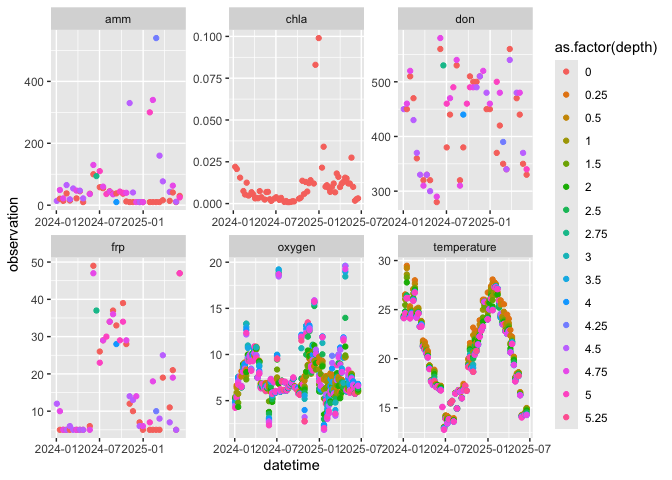
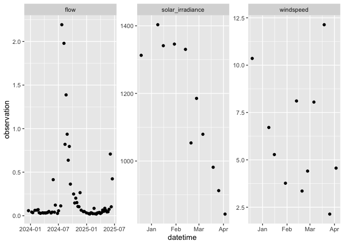
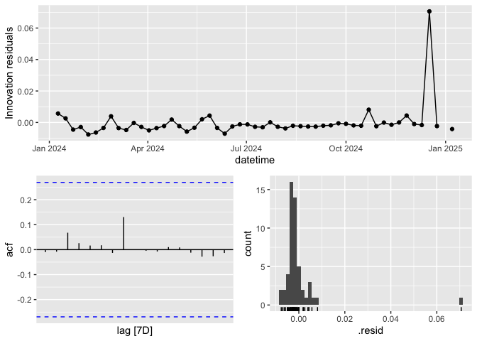
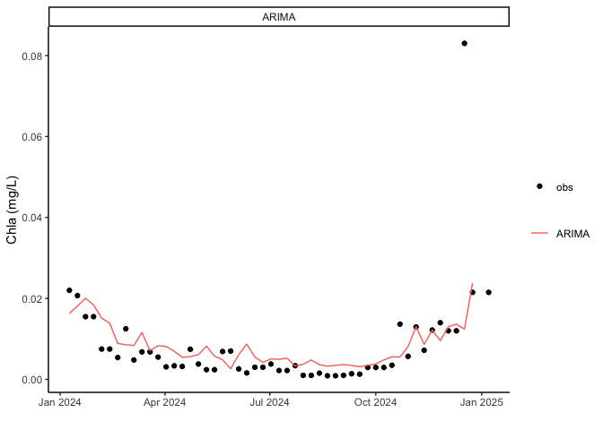
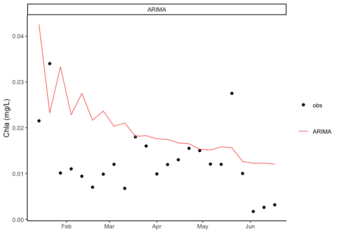

Load packages (install any you don’t have!)

    library(tidyverse)

    ## ── Attaching core tidyverse packages ──────────────────────── tidyverse 2.0.0 ──
    ## ✔ dplyr     1.1.4     ✔ readr     2.1.5
    ## ✔ forcats   1.0.0     ✔ stringr   1.5.1
    ## ✔ ggplot2   3.5.2     ✔ tibble    3.2.1
    ## ✔ lubridate 1.9.4     ✔ tidyr     1.3.1
    ## ✔ purrr     1.0.4     
    ## ── Conflicts ────────────────────────────────────────── tidyverse_conflicts() ──
    ## ✖ dplyr::filter() masks stats::filter()
    ## ✖ dplyr::lag()    masks stats::lag()
    ## ℹ Use the conflicted package (<http://conflicted.r-lib.org/>) to force all conflicts to become errors

    library(lubridate)
    library(zoo)

    ## 
    ## Attaching package: 'zoo'
    ## 
    ## The following objects are masked from 'package:base':
    ## 
    ##     as.Date, as.Date.numeric

    library(fable)

    ## Loading required package: fabletools
    ## Registered S3 method overwritten by 'tsibble':
    ##   method               from 
    ##   as_tibble.grouped_df dplyr

    library(feasts)
    library(urca)
    library(tsibble)

    ## 
    ## Attaching package: 'tsibble'
    ## 
    ## The following object is masked from 'package:zoo':
    ## 
    ##     index
    ## 
    ## The following object is masked from 'package:lubridate':
    ## 
    ##     interval
    ## 
    ## The following objects are masked from 'package:base':
    ## 
    ##     intersect, setdiff, union

Source function from Sherry

    source('fct_awss3Connect_OG.R')

Download raw profile data

    profile_data_download <- awss3Connect(filename = 'arms/wiski.csv')

Data wrangling code for profile data from Austin

    sensor_codes <- read_csv("./sensorcode.csv")

    ## Rows: 35 Columns: 12
    ## ── Column specification ────────────────────────────────────────────────────────
    ## Delimiter: ","
    ## chr (9): Stn_text_ref, Stn_name, s_graph_value, s_table_name, Group, Agency,...
    ## dbl (3): Index, Lat, Long
    ## 
    ## ℹ Use `spec()` to retrieve the full column specification for this data.
    ## ℹ Specify the column types or set `show_col_types = FALSE` to quiet this message.

    # pull BAC site per Matt's recommendation
    cannsites <- c('BAC')

    profile_data <- profile_data_download %>%  
      dplyr::filter(`Program Site Ref` %in% cannsites) |> 
      select(site_ref = `Site Ref`, 
             program = `Program Site Ref`, 
             time = `Collect Time`, 
             date = `Collect Date`, 
             depth = `Sample Depth (m)`, 
             temperature = `Temperature (deg C)`, 
             oxygen = `O2-{DO conc} (mg/L)`,
             don = `N (sum sol org) {DON} (ug/L)`,
             chla = `Chlorophyll a (by vol) (mg/L)`,
             frp = `PO4-P (sol react) {SRP FRP} (ug/L)`,
             nit = `NO3-N (sol) (ug/L)`,
             amm = `NH3-N/NH4-N (sol) (ug/L)`) |> 
      mutate(time = format(strptime(time, "%I:%M:%S %p"), "%H:%M:%S")) |> # convert from AM/PM to 24-hour 
      mutate(datetime = paste(date, time))

    profile_data_grouped <- profile_data |> 
      mutate(depth_rounded = plyr::round_any(depth, 0.25))  |> # bin depths by rounding -- matches depth configuration 
      select(-depth) |> 
      rename(depth = depth_rounded) |> 
      dplyr::filter(!is.na(depth)) |> 
      pivot_longer(cols = temperature:amm, names_to = 'variable', values_to = 'data') |> 
      summarise(observation = mean(data, na.rm = TRUE), .by = c("datetime","variable","depth")) |> 
      mutate(datetime = lubridate::force_tz(lubridate::as_datetime(datetime, format = '%d/%m/%Y %H:%M:%S')), tzone = 'Australia/Perth') |>
      mutate(datetime = lubridate::with_tz(datetime, tzone = "UTC")) |> 
      mutate(datetime = lubridate::round_date(datetime, unit = 'hour')) |> 
      mutate(site_id = 'BAC') |> 
      select(datetime, site_id, depth, observation, variable) |> 
      mutate(date = as.Date(datetime)) |> 
      group_by(date, variable) |> 
      mutate(min_datetime = min(datetime)) |> 
      ungroup() |> 
      group_by(date, variable) |> 
      dplyr::filter(datetime == min_datetime) |> 
      ungroup() |> 
      dplyr::filter(!is.nan(observation)) |> 
      group_by(date, variable, site_id, depth) |>
      summarize(observation = mean(observation, na.rm = TRUE)) %>%
      ungroup() %>%
      select(datetime = date, site_id, depth, observation, variable) %>%
      arrange(datetime, variable, depth)

    ## `summarise()` has grouped output by 'date', 'variable', 'site_id'. You can
    ## override using the `.groups` argument.

Plot wrangled profile data

    plot_dat <- profile_data_grouped %>%
      filter(year(datetime) %in% c(2024:2025))

    ggplot(data = plot_dat) +
      geom_point(aes(x = datetime, y = observation, group = as.factor(depth), color = as.factor(depth)))+
      facet_wrap(facets = vars(variable), scales = "free")

Get dates of chlorophyll-a observations, then identify closest-in-time
observations for other variables and join into one dataframe

    chla_dates <- profile_data_grouped %>%
      filter(variable == "chla") %>%
      group_by(datetime) %>%
      filter(depth == 0) %>%
      pull(datetime)

    vars <- unique(profile_data_grouped$variable)[-1]

    for(i in 1:length(vars)){
      
      var.df <- profile_data_grouped %>%
        filter(variable == vars[i]) 
      
      if(vars[i] == "oxygen") {
        var.df <- var.df %>%
          group_by(datetime) %>%
          filter(depth == max(depth, na.rm = TRUE)) %>%
          ungroup()
      } else if(vars[i] == "temperature") {
        var.df <- var.df %>%
          group_by(site_id, datetime, variable) %>%
          filter(depth <= 1) %>%
          summarize(observation = mean(observation, na.rm = TRUE)) %>%
          add_column(depth = 1) %>%
          ungroup()
      } else {
        var.df <- var.df %>%
          group_by(datetime) %>%
          filter(depth == 0) %>%
          ungroup()
      }
      
      var.df.final<-data.frame()
      
      for (j in 1:length(chla_dates)){
        
        nearest.date <-  var.df %>% 
          slice(which.min(abs(datetime - chla_dates[j])))
        
        if(abs(nearest.date$datetime[1] - chla_dates[j]) > 5) next
        
        nearest.date$chla_dates <- chla_dates[j]
        
        # Bind each of the data layers together.
        var.df.final = bind_rows(var.df.final, nearest.date)
        
      }
      
      if(i == 1){
        df.final <- var.df.final
      } else {
        df.final <- bind_rows(df.final, var.df.final)
      }
      
    }

    ## `summarise()` has grouped output by 'site_id', 'datetime'. You can override
    ## using the `.groups` argument.

Get met and flow data

1.  wind ‘sensor\_repository\_84749’.  
2.  flow ‘sensor\_repository\_00804’.  
3.  light’sensor\_repository\_00962’.

<!-- -->

    sensorCodes = c('sensor_repository_00804','sensor_repository_84749','sensor_repository_00962')
    code_df = sensor_codes

    filename = 'arms/wiski.csv'
    bucket <- 'scevo-data'

    fetchedData  <- data.frame()

    for (i in sensorCodes) {
      object <- paste0("/arms/",i,".csv")
      print(object)
      #object <- paste0("/arms/",sensorCodes[i],".csv")
      rawSensorData <- aws.s3::s3read_using(FUN = utils::read.csv,
                                            check.names = FALSE,
                                            encoding = "UTF-8",
                                            # show_col_types = FALSE,
                                            # lazy = FALSE,
                                            # progress = FALSE,
                                            object = object,
                                            bucket = bucket,
                                            filename = basename(filename),
                                            opts = list(
                                              base_url = "projects.pawsey.org.au",
                                              region = "",
                                              key = "2f1a9d81bdf24a178b2bd18d530e959b",
                                              secret = "e062073c1faf488cb4209ba8de2eb483"))
      
      sensorData <- rawSensorData %>%
        mutate(date = as.POSIXct(Date*86400, 
                                 origin=structure(-210866760000, 
                                                  class=c("POSIXct", "POSIXt"),
                                                  tzone="GMT"))) %>%
        mutate(date = format(round(date, units="hours"), format="%Y-%m-%d %H:%M:%S")) %>%
        arrange(date)
      
      sensorData$s_table_name <- i
      sensorData$variable <- code_df[which(code_df$s_table_name == i),'s_graph_value'][[1]]
      sensorData$unit <- code_df[which(code_df$s_table_name == i),'Unit'][[1]]
      sensorData <- sensorData %>%
        select(-QC, -Height, -Date) %>%
        rename(observation = Data) %>%
        filter(!is.na(observation)) %>%
        select(date, s_table_name, variable, unit, observation)
      fetchedData <- rbind(fetchedData, sensorData)
    }

    ## [1] "/arms/sensor_repository_00804.csv"
    ## [1] "/arms/sensor_repository_84749.csv"
    ## [1] "/arms/sensor_repository_00962.csv"

Data wrangling to aggregate high-frequency data

    dailyData <- fetchedData %>%
      mutate(day = date(date)) %>%
      group_by(day, s_table_name, variable, unit) %>%
      summarize(observation = mean(observation, na.rm = TRUE)) %>%
      ungroup() %>%
      rename(datetime = day) %>%
      mutate(variable = ifelse(variable == "Flow (m3/s)","flow",
                               ifelse(variable == "Wind Speed avg","windspeed",
                                      ifelse(variable == "Solar Irradiance","solar_irradiance",NA))),
             obs_datetime = datetime) %>%
      filter(!is.na(variable)) %>%
      add_column(depth = NA,
                 site_id = "SP") %>%
      select(site_id, datetime, depth, variable, observation, obs_datetime) %>%
      filter(datetime %in% chla_dates)

    ## `summarise()` has grouped output by 'day', 's_table_name', 'variable'. You can
    ## override using the `.groups` argument.

Plot met and flow data  
**oofta where is all the solar irradiance and wind data after April
2024?**

    ggplot(data = dailyData)+
      geom_point(aes(x = datetime, y = observation)) +
      facet_wrap(facets = vars(variable), scales = "free")

Wrangle to get ALL the variables in one dataframe

    chla_df <- profile_data_grouped %>%
      filter(variable == "chla") %>%
      group_by(datetime) %>%
      filter(depth == 0) %>%
      ungroup() %>%
      mutate(chla_dates = datetime) %>%
      bind_rows(., df.final) %>%
      rename(obs_datetime = datetime) %>%
      rename(datetime = chla_dates) %>%
      bind_rows(., dailyData)

Plot final dataframe

    plot_dat <- chla_df %>%
      filter(year(datetime) %in% c(2024:2025))

    ggplot(data = plot_dat)+
      geom_point(aes(x = datetime, y = observation, group = as.factor(depth), color = as.factor(depth)))+
      facet_wrap(facets = vars(variable), scales = "free_y")+
      theme_bw()

Format for model fitting **this is currently really ugly and manual-
might be better to use base arima function which is less picky about
time gaps, especially if people will be uploading their own data later**

    model_df <- chla_df %>%
      filter(year(datetime) %in% c(2024:2025)) %>%
      select(-obs_datetime, -site_id, -depth) %>%
      pivot_wider(names_from = "variable", values_from = "observation") %>%
      mutate(datetime = ifelse(datetime == "2025-03-05",datetime - 3, #ugly manual fixing of weeks :-/
                    ifelse(datetime == "2025-04-23",datetime - 3,
                           ifelse(datetime == "2025-01-29",datetime - 3, 
                                  ifelse(datetime == "2025-06-04", datetime - 3, datetime))))) %>%
      mutate(datetime = as.Date(datetime, origin = "1970-01-01")) %>%
      mutate(week = week(datetime),
             year = year(datetime))

    year_week <- data.frame(year = rep(c(2024,2025), each = 52),
                            week = rep(c(1:52), times = 2))

    model_df2 <- left_join(year_week, model_df, by = c("year","week")) %>%
      filter(!(year == 2025 & week > 24)) %>%
      select(-solar_irradiance, -windspeed) %>% # just don't have enough data to make this worthwhile
      slice(-1) %>%
      fill(chla:flow, .direction = "updown") 

    model_df3 <- model_df2 %>%
      mutate(mod_datetime = c(seq(from = as.Date("2024-01-09"), by = "week", length.out = 51),seq(from = as.Date("2025-01-07"), by = "week", length.out = 24))) %>%
      select(-datetime) %>%
      rename(datetime = mod_datetime)

Fit and assess ARIMA model from fable package

    model_df4 <- as_tsibble(model_df3) %>%
      slice_head(prop = .7) %>% # using a 70:30 split here
      fill_gaps()

    ## Using `datetime` as index variable.

    my.arima <- model_df4 %>%
      model(`ARIMA` = fable::ARIMA(formula = chla ~ frp + flow)) # get errors if include all variables due to small data size

    params <- coefficients(my.arima %>% select(`ARIMA`))

    gg_tsresiduals(my.arima %>% select(`ARIMA`))

    ## Warning: Removed 1 row containing missing values or values outside the scale range
    ## (`geom_point()`).

    ## Warning: Removed 1 row containing non-finite outside the scale range
    ## (`stat_bin()`).

    fitted_values <- fitted(my.arima)

    ARIMA_plot <- ggplot()+
      xlab("")+
      ylab("Chla (mg/L)")+
      geom_point(data = model_df4, aes(x = datetime, y = chla, fill = "obs"))+
      geom_line(data = fitted_values, aes(x = datetime, y = .fitted, group = .model, color = .model))+
      facet_wrap(facets = vars(.model))+
      labs(color = NULL, fill = NULL)+
      theme_classic()
    ARIMA_plot      

    ## Warning: Removed 1 row containing missing values or values outside the scale range
    ## (`geom_point()`).

Generate predictions for test set data

    # get test data
    new.data <- as_tsibble(model_df3) %>%
      filter(!datetime %in% model_df4$datetime) %>%
      fill_gaps()

    ## Using `datetime` as index variable.

    # generate predictions on test data
    pred <- forecast(my.arima, new_data = new.data)

    # plot predictions
    ARIMA_pred_plot <- ggplot()+
      xlab("")+
      ylab("Chla (mg/L)")+
      geom_point(data = new.data, aes(x = datetime, y = chla, fill = "obs"))+
      geom_line(data = pred, aes(x = datetime, y = .mean, group = .model, color = .model))+
      facet_wrap(facets = vars(.model))+
      labs(color = NULL, fill = NULL)+
      theme_classic()
    ARIMA_pred_plot    

Still need to add assessment of model predictions vs. observations
